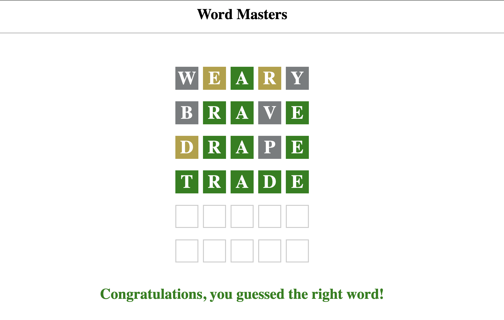

# Wordle Clone

Explore a live version here: [Wordle](https://kratharth-1999.github.io/wordle-clone/code/)

Wordle is a web-based word game created and developed by Welsh software engineer Josh Wardle. In the game, players have six attempts to guess a five-letter word, receiving feedback through colored tiles that indicate correct letters and their placement. A single puzzle is released daily, with all players attempting to solve the same word.

Tech stack:

-   HTML
-   CSS
-   Javascript

